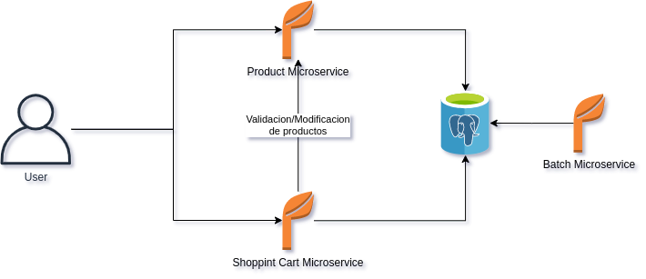
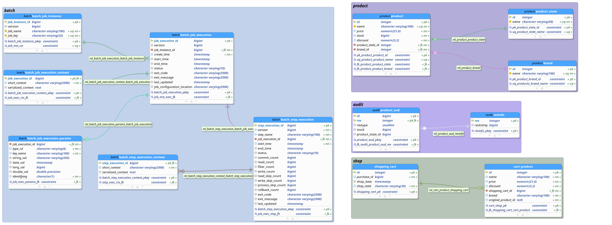

basic-store
# Tecnologías

- Docker
  - Dockerfile
  - Docker-compose
- Database
  - H2
  - Postgresql
- Spring Boot
  - Batch
  - Web
  - Data
  - Envers
- Script Shell
- Gradle
  - Jacoco Plugin
- Git
- OpenApi 3
- Lenguajes
  - Java
  - Sql

# Despliegue

Para levantar el ambiente, solamente se debe ejecutar el script start.sh, este script compilara los proyectos e imágenes docker para posteriormente levantarlos en el ambiente local como servicios de docker-compose

## Spring Bacth

Para cargar el(los) archivo(s) a procesar, se debe ubicar en la ruta _ **/tmp** _ con el nombre _ **input.csv** _ de esta forma el servicio cargará el archivo y lo analizará para su procesamiento y persistencia, al terminar el mismo será renombrado con el fin de no seguir cargando el mismo n veces

# Esquema

# Modelo de datos

Se separa por esquemas el modelo de datos según las operaciones sobre ellos por microservicio, además de crear un esquema común para auditoria

# Servicios

Se cargan las colecciones de postman con sus respectivas firmas y descripciones para los consumos en la carpeta API

## Swagger

Se deja la dependencia para poder consumir las API&#39;s desde swagger

## Pruebas

Por cuestión de tiempo se deja solo una prueba unitaria y una de integración en product-service

## Spring Batch

Con el fin de cumplir con el requerimiento se crean 2 tasklet y 1 Step(Reader, Processor, Writer), donde los tasklet se encargan de limpiar la base de datos y renombrar el archivo procesado.

## Docker

Cada microservicio tiene su Dockerfile para su construcción y este es orquestado por el docker-compose.yml en la raiz del proyecto

## Base de datos

Se usa H2 para los test y postgresql en el despliegue